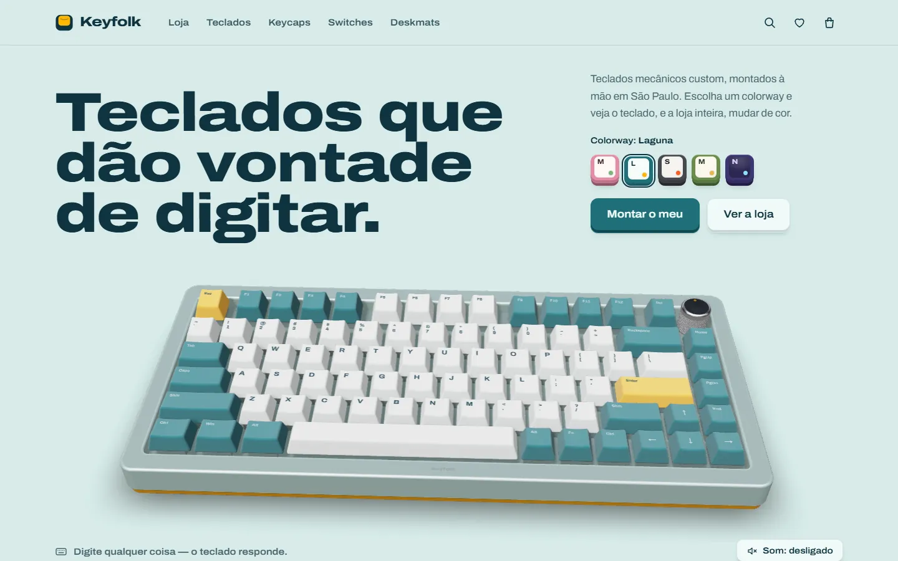
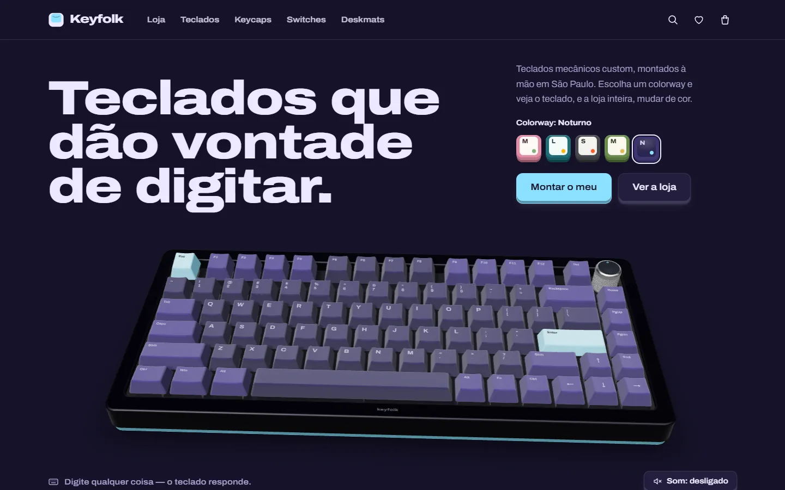
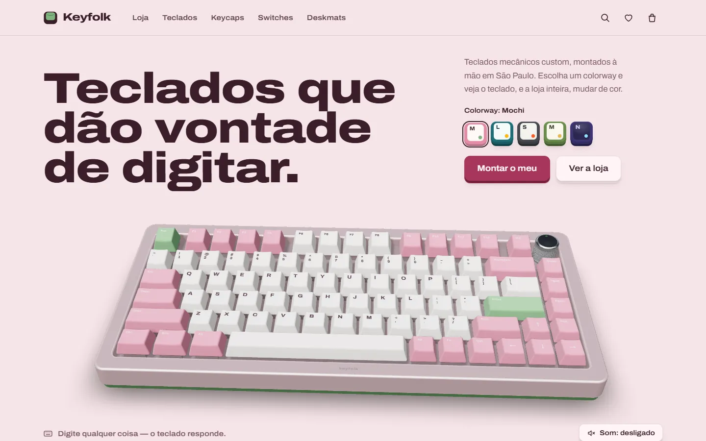
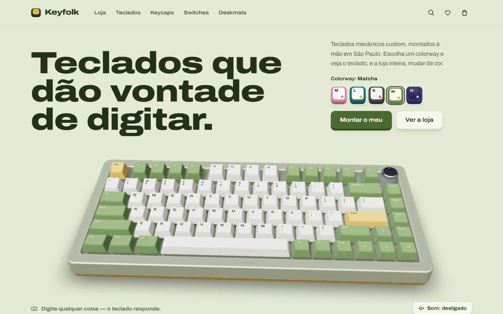
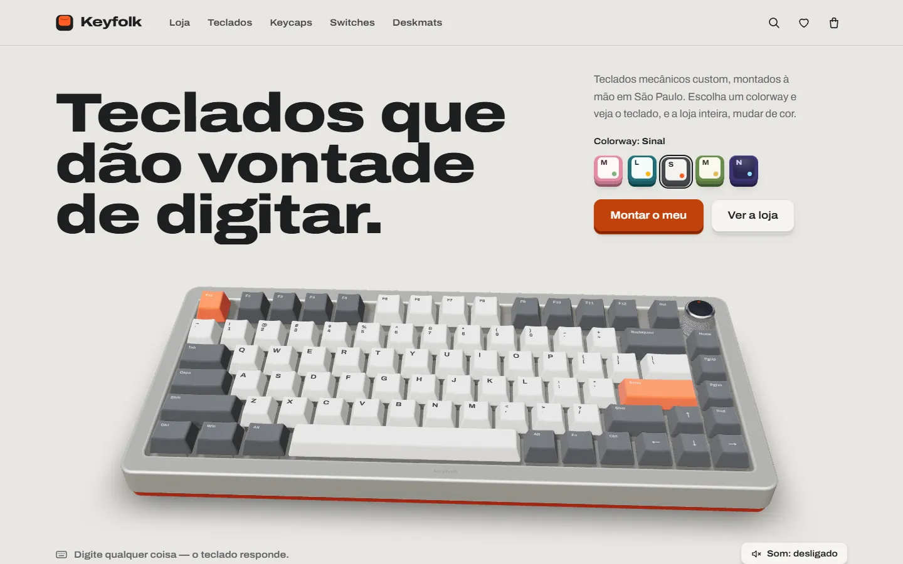
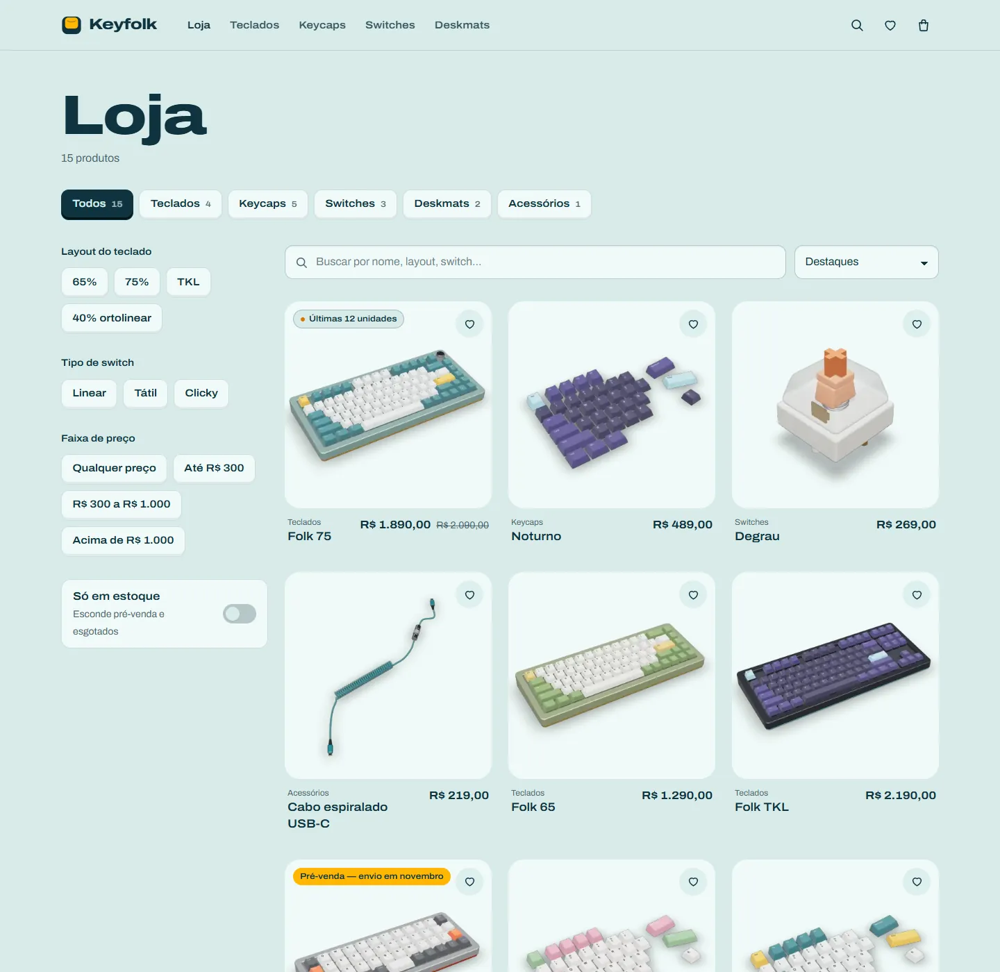
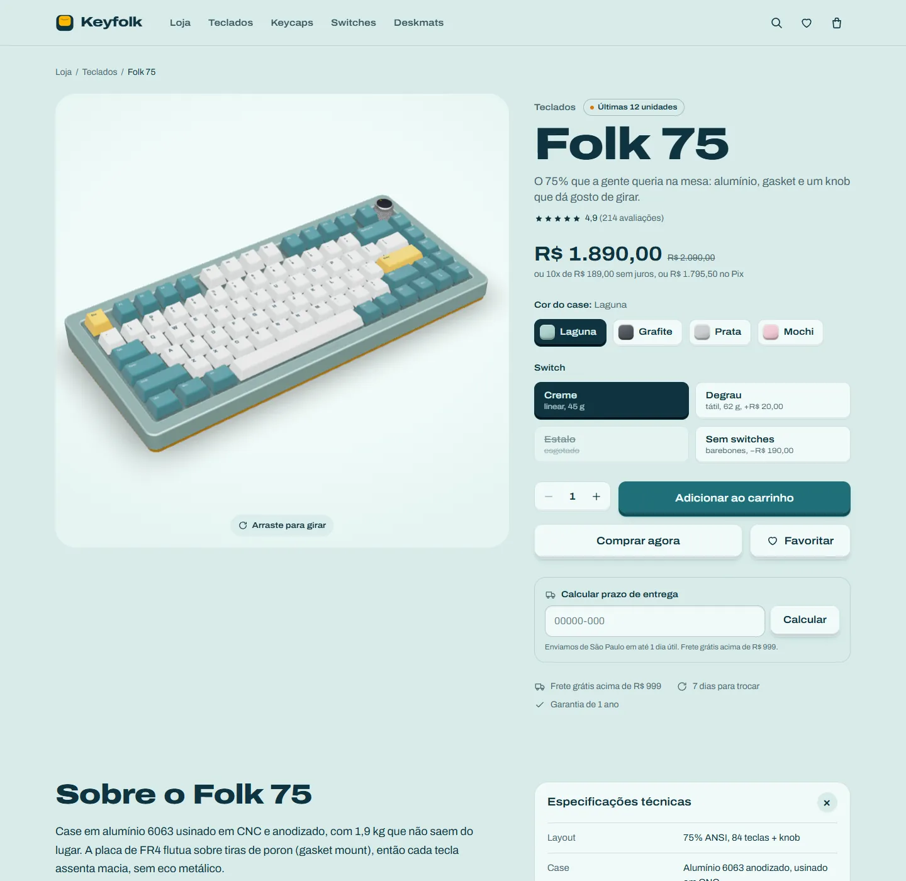
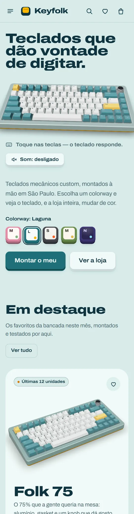
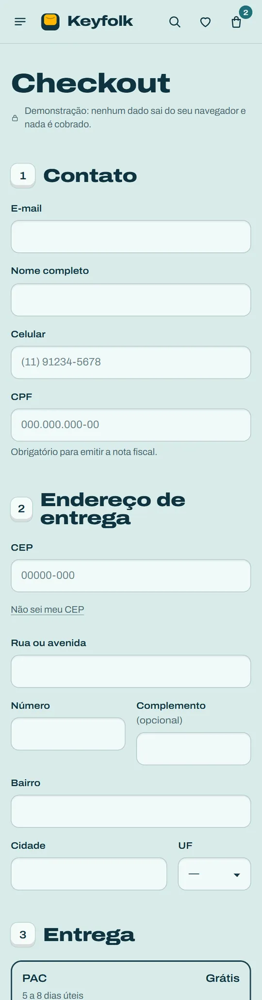

# Keyfolk

Loja de teclados mecânicos custom, feita como peça de portfólio. Tudo em pt-BR, preços em reais, e uma ideia central:
**o teclado 3D da home responde ao seu teclado de verdade**. Digite qualquer coisa e a tecla certa desce, com
som sintetizado ao vivo se você quiser. Troque o _colorway_ e o teclado, e a loja inteira, mudam de cor.

Nenhum pedido é real e nenhum dado sai do navegador. Todas as imagens de produto foram renderizadas a partir dos
nossos próprios modelos 3D procedurais: não há foto de banco nem modelo baixado.



| Noturno | Mochi | Matcha | Sinal |
| --- | --- | --- | --- |
|  |  |  |  |

| Loja | Produto | Home (celular) | Checkout (celular) |
| --- | --- | --- | --- |
|  |  |  |  |

## O que tem aqui

- **Home** com o Folk 75 em 3D (R3F): teclas reagem ao teclado físico (`keydown`/`keyup`, sem roubar o foco de
  campos de texto) e ao toque/clique; entrada orquestrada do teclado e do título; controle de som desligado por padrão.
- **Cinco colorways** (Laguna, Mochi, Sinal, Matcha, Noturno) que retingem o site inteiro via tokens CSS em
  `html[data-colorway]`. A escolha fica salva e é aplicada por um script inline antes do primeiro paint, sem piscar.
- **Laboratório de som**: escolha linear, tátil ou clicky e aperte a tecla; curva de força por tipo de switch.
- **Loja** (`/loja`) com categorias, filtros (layout, tipo de switch, faixa de preço, só em estoque), ordenação e
  busca sem acento. Todo o estado mora na URL, então qualquer filtro é compartilhável. Estado vazio com "Limpar filtros".
- **Produto** (`/produto/[slug]`, 15 páginas estáticas) com visualizador 3D (girar, zoom limitado, sem pan, gira sozinho
  até você interagir, respeita `prefers-reduced-motion`), pôster sem layout shift até o 3D ficar pronto, variações
  (cor do case e switch nos teclados, tamanho do pack nos switches), estoque, "Avise-me" para esgotados, prazo por CEP,
  especificações em `<details>`, "Combina com", favoritos e JSON-LD `Product`.
- **Carrinho** em gaveta `<dialog>` nativa (foco preso, Esc fecha, foco volta ao botão) e em `/carrinho`, persistido em
  `localStorage`, com barra de frete grátis (acima de R$ 999), cupom `FOLK10` (10%) e anúncios em `aria-live`.
- **Checkout** com máscaras (celular, CPF, CEP, cartão), validação inline acessível (`aria-invalid`,
  `aria-describedby`, foco no primeiro erro), endereço pelo ViaCEP com falha graciosa, PAC/SEDEX, Pix/cartão/boleto.
  A confirmação mostra número do pedido e um QR ilustrativo gerado em SVG.
- **Favoritos**, **404 com personalidade**, `sitemap.xml`, `robots.txt`, `manifest.webmanifest`, favicon SVG e
  imagens Open Graph geradas com `ImageResponse` para a home e para cada produto.

## Stack

- Next.js 16 (App Router, Turbopack, React Compiler), React 19, TypeScript estrito
- Tailwind CSS 4 com tokens próprios em `src/app/globals.css`
- three.js 0.182, @react-three/fiber 9, @react-three/drei 10
- zustand 5 (carrinho, favoritos, colorway, som, UI) com `persist`
- Playwright para testes E2E e para o pipeline de renderização das imagens
- Fonte Archivo via `next/font` (servida pelo próprio site; os TTFs em `public/fonts` alimentam as legendas 3D)

## Como rodar

```bash
npm install
npx playwright install chromium   # só na primeira vez
npm run dev -- -p 3200            # http://localhost:3200
```

| Script | O que faz |
| --- | --- |
| `npm run dev` | servidor de desenvolvimento |
| `npm run build` / `npm start` | build de produção (todas as páginas são estáticas) e servidor |
| `npm run lint` | ESLint (`eslint .`) |
| `npm run test:e2e` | Playwright: faz o build, sobe `next start` na porta 3210 e roda desktop + Pixel 7 |
| `npm run render` | renderiza as imagens de produto em `public/renders/` (precisa do `npm run dev` rodando) |
| `node scripts/readme-images.mjs` | gera as cópias leves em WebP dos screenshots usados neste README (`docs/screenshots/`) |

Não há variáveis de ambiente obrigatórias. A URL absoluta usada em canonical, Open Graph e sitemap vem do domínio de
produção que a Vercel injeta no build (`VERCEL_PROJECT_PRODUCTION_URL`); `NEXT_PUBLIC_SITE_URL` sobrescreve se precisar.

## Arquitetura

```
src/
  app/            rotas (home, loja, produto, carrinho, checkout, favoritos), SEO, OG, rota /render (só dev)
  components/     UI por domínio: home, catalog, product, cart, checkout, colorway, layout, ui
  data/           catálogo tipado (products.ts)
  lib/            regras puras: busca/filtros, carrinho e cupom, frete, validação, formatação BRL, som
  store/          stores zustand
  three/
    lib/          geometria das teclas, case, layouts, paleta, animador de teclas, textura do deskmat
    models/       Keyboard, Keycap, Knob, Switch, Deskmat, Cable
    scenes/       Studio (luz), canvases da home/produto/laboratório/render e enquadramentos
e2e/              testes Playwright + screenshots
scripts/          render-products.mjs, readme-images.mjs
```

### O 3D

- **Teclas com medidas reais.** Passo de 19,05 mm entre centros, tecla 1u com ~18 mm na base e ~12,5 mm no topo,
  perfil esculpido estilo Cherry (de 8,2 mm na fileira home a 10,6 mm na fileira F, com inclinação por fileira) e topo
  côncavo. A geometria é gerada uma vez por largura/fileira e compartilhada; os materiais são compartilhados por papel
  (alfa, modificador, destaque, legenda).
- **Layouts de verdade**: 75% com knob, 65%, TKL e 40% ortolinear, descritos em `three/lib/layouts.ts`.
- **Case** extrudado com chanfro, lábio inferior de cor contrastante e alumínio anodizado em `MeshPhysicalMaterial`
  com clearcoat leve. Knob recartilhado, switch com housing translúcido, stem, mola e terminais, deskmat com textura
  desenhada em canvas, cabo espiralado em `TubeGeometry` com conector aviador.
- **Luz de estúdio só com `Lightformer`s** (softbox, réguas laterais para os brilhos no chanfro, fill quente, rim frio),
  `ContactShadows` suave e tone mapping ACES. Nenhum HDR baixado.
- **Legendas** com `<Text>` do drei usando a Archivo servida pelo próprio site.

### Pipeline de imagens

As imagens de catálogo, pôsteres do hero e do laboratório e as imagens OG vêm dos mesmos modelos:

1. `src/app/render/[slug]` renderiza um produto sozinho, enquadrado, com fundo transparente, e marca
   `window.__RENDER_READY__`. Em produção a rota responde 404 e está bloqueada no `robots.txt`.
2. `scripts/render-products.mjs` abre cada slug no Chromium com GPU, tira o screenshot sem fundo (1600×1600, ou
   2.5:1 no hero) e converte para WebP com `sharp` em `public/renders/`, incluindo variações de cor do case.
   Use `npm run render -- folk-75 hero-laguna` para renderizar só alguns.

### Performance

- Tudo é estático (SSG). O pôster WebP pré-renderizado com a mesma câmera é o LCP. O canvas (`next/dynamic`,
  `ssr: false`) só começa depois do evento `load` e em tempo ocioso, então o 3D nunca disputa o primeiro paint, e
  aparece com fade por cima do pôster. Nada muda de tamanho.
- **Só com GPU de verdade.** Se o navegador fosse desenhar o WebGL em software (sem GPU, driver bloqueado, headless),
  o site mantém os pôsteres, que mostram o mesmo teclado, em vez de uma cena travando a CPU
  (`failIfMajorPerformanceCaveat` + nome do renderer, em `src/lib/live3d.ts`).
- **Sem travadas na primeira imagem.** A cena é montada como transição do React (a raiz do R3F é concorrente, então o
  trabalho sai em fatias), o canvas fica em `frameloop="never"` até `renderer.compileAsync()` compilar todos os shaders
  em paralelo (`KHR_parallel_shader_compile`) e só então desenha (`src/three/lib/useCompileGate.ts`).
- `frameloop="demand"`: só renderiza quando algo anima (tecla, rotação, troca de cor). O canvas pausa fora da tela
  (IntersectionObserver), `dpr` vai até 1,75 (1,5 no celular) e cai para 1 com `PerformanceMonitor`.
- O laboratório de som só monta o 3D quando chega perto da tela.
- Imagens via `next/image` com `sizes` corretos; `loading="eager"` + `fetchPriority="high"` só nos candidatos a LCP.
- Lighthouse (build de produção, perfil do PageSpeed, sem GPU): Performance 97 no celular e 100 no desktop;
  Acessibilidade, Boas práticas e SEO 100.

### Acessibilidade

Link "Pular para o conteúdo", landmarks, um `h1` por página, foco visível, tudo operável por teclado, rótulos em
todos os campos, `alt` em todas as imagens, `aria-live` para carrinho e filtros, `prefers-reduced-motion` respeitado
(sem rotação automática nem ondas; as teclas continuam respondendo porque são ação do usuário) e contraste AA nos cinco
colorways, verificado com axe em todas as páginas principais de cada um deles.

## Testes

Só E2E, com Playwright (`e2e/`), em dois projetos: Chromium desktop 1440×900 e Pixel 7. Cobrem: home com destaques e
WebGL real; tecla física pressionando a tecla 3D (`data-last-key`); digitação em campo de texto sem acionar o teclado;
colorway aplicado ao `html` e persistido após recarregar; filtros, busca, ordenação, estado vazio e URL compartilhável;
variação e preço no produto; carrinho persistente, gaveta modal e cupom válido/inválido; checkout com erros, máscaras,
ViaCEP simulado com `page.route` (sucesso, CEP inexistente e falha de rede) até a página de sucesso; 404; e um smoke
de acessibilidade/SEO por página (um `h1`, `alt`, landmarks, skip link, canonical, JSON-LD, sem rolagem horizontal e
sem erros ou avisos no console); e axe (WCAG 2.1 AA, contraste incluído) em seis páginas para cada um dos cinco
colorways.

```bash
npm run test:e2e                     # build + next start na porta 3210 + testes
npx playwright show-report e2e/report
```

Artefatos verificáveis de cada execução: o relatório HTML em `e2e/report/` e os screenshots de página inteira de todas
as telas, em desktop e celular, em `e2e/screenshots/` (ambos regenerados a cada execução e fora do git). As cópias leves
usadas neste README ficam em `docs/screenshots/` (`node scripts/readme-images.mjs`).
